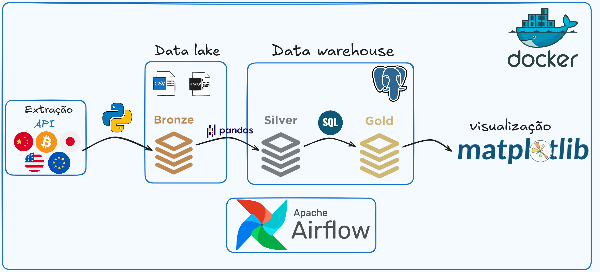
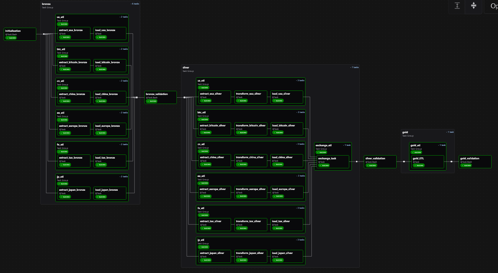

# Data Pipeline Macroeconômico

Pipeline de dados end-to-end para ingestão, transformação e disponibilização de dados macroeconômicos, com foco na análise da relação entre liquidez de oferta monetária global e o preço do Bitcoin.

## Problema de Negócio

Este projeto nasceu de uma dúvida:
existe, de fato, uma relação entre a macroeconomia e o preço do Bitcoin?

Em vez de aceitar respostas prontas de sites, decidi aplicar na prática um dos princípios mais conhecidos do próprio Bitcoin:
**“Don't trust, verify.”**

A proposta, então, foi clara:
construir um pipeline de dados capaz de coletar, tratar e integrar informações macroeconômicas relevantes — como liquidez global (M2) e câmbio — para investigar, com dados reais, possíveis correlações com o comportamento do Bitcoin.

Mais do que responder uma pergunta, este projeto busca transformar curiosidade em uma arquitetura estruturada, reprodutível e orientada a dados.

## Arquitetura

-> Layers
- Bronze
- Silver
- Gold

-> Armazenamento
- Arquivos interno do container como **Data lake**
- PostgreSQL com **Data warehouse**

-> Orquestração
- Apache Airflow

-> Infraestrutura
- Docker

## Experiência e dificuldades

👉 Aqui relato alguns dos principais aprendizados obtidos ao longo do desenvolvimento deste projeto:

- Na etapa de ingestão (camada Bronze), tive contato prático com consumo de dados externos, utilizando tanto APIs com autenticação quanto requisições sem chave, além de técnicas de web scraping com a biblioteca Requests.

- Aprimorei o uso do Pandas para transformação de dados, lidando com limpeza, padronização, junção de datasets e tratamento de inconsistências. Trabalhar com **6 fontes de dados reais** trouxe desafios significativos — e muitas horas de debug — fundamentais para meu aprendizado!

- Aprendi a estruturar um pipeline seguindo o conceito de arquitetura em camadas (Bronze, Silver e Gold), entendendo na prática a importância da separação entre dados brutos, tratados e prontos para análise.

- Desenvolvi habilidades na orquestração de workflows com Apache Airflow, incluindo criação de DAGs, definição de dependências e organização de tarefas utilizando boas práticas como criação de TaskGroups.

- Tive experiência prática com integração entre serviços via Docker, garantindo um ambiente isolado, reproduzível e consistente para execução do pipeline, subindo via docker-compose.

- Enfrentei problemas reais de engenharia de dados, como falhas de conexão, inconsistência de dados e necessidade de reprocessamento, o que me permitiu entender melhor a importância de pipelines resilientes.

- Estruturei o carregamento de dados em um Data Warehouse (PostgreSQL) estabelecendo conexão por containers separados.